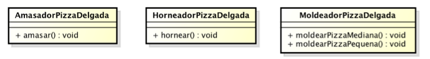
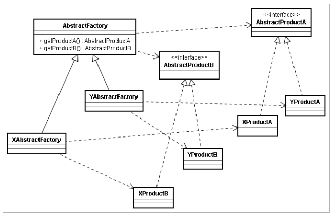
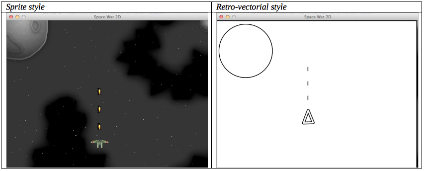

# Universidad de la Sabana
## Diseño y Arquitectura de Software


Software de microcontrolador para la fabricación automática de pizza.

#### Parte I. 
El siguiente, es un modelo de clases de una aplicación que se comunica con un microcontrolador encargado de la fabricación automática de pizzas. Dichas clases encapsulan la lógica para amasar, hornear y moldear pizzas de las pizzas delgadas.



El programa principal del micro-controlador utiliza la siguiente función, la cual depende de las clases antes mostradas:

```Java
public void prepararPizza(Ingredientes[] ingredientes, Tamano tam) 
throws ExcepcionParametrosInvalidos{
	AmasadorPizzaDelgada am=new AmasadorPizzaDelgada();
	HorneadorPizzaDelgada hpd=new HorneadorPizzaDelgada();
	MoldeadorPizzaDelgada mp=new MoldeadorPizzaDelgada();
	am.amasar();
	if (tam == Tamano.PEQUENA){
		mp.moldearPizzaPequena();
	}
	else if(tam==Tamano.MEDIANA){
		mp.molderarPizzaMediana();
	}
	else{
		throw new ExcepcionParametrosInvalidos (“Tamano de piza invalido:”+tam);
	}
		aplicarIngredientes(ingredientes);
		hpd.hornear();
	}
	...
```

Se quiere actualizar el software, ya que el fabricante de las máquina va a sacar al mercado unas variantes de la máquina original, y quiere simplificar el proceso de adaptación del código de los microcontroladores. Por ahora se espera sacar dos variantes:

*	Máquina para preparar pizzas de masa gruesa (masa de pan).
*	Máquina para preparar pizzas de masa integral.

Es importante tener en cuenta que para dichas variantes, aunque la secuencia de pasos del proceso principal es el mismo, los procesos de amasado, moldeado y horneado son diferentes para cada variante.

Dado que es posible que en el futuro salgan variantes adicionales de esta máquina, y que se sabe que la secuencia de pasos en general NO cambiará, se le ha pedido que el software quede escrito de manera que la lógica básica no requiera cambios, independientemente de cómo se amase, como se hornee y cómo se moldee en dichas variantes.

1.	Teniendo esto en cuenta, y considerando el patrón de fábrica abstracta, plantee el modelo de clases que permitiría desacoplar la lógica de la fabricación de pizzas, de las diferentes manera como se pueden realizar las actividades de bajo nivel relacionadas (cocción, corte, etc.).

2.	Descargue el proyecto mediante el comando git (git clone) :
```
git clone https://github.com/CesarAVegaF312/DYAS-GoF-Patterns-Creational-PizzaFactory.git
```
	y ábralo en el IDE NetBeans.

3.	Revise el funcionamiento actual de la aplicación. Como este es un proyecto Maven, ejecútelo a través de la línea de comando (desde el directorio del proyecto):

```
mvn clean install
mvn exec:java -Dexec.mainClass="edu.unisabana.pizzafactory.consoleview.PreparadorPizza"
```

4.	Implemente el modelo propuesto. Para compilar después de haber hecho cambios, hágalo a través de Maven con: 

```
mvn compile
```

Nota: Si lo desea, puede revisar una [implementación de referencia del patrón Fábrica Abstracta](https://github.com/CesarAVegaF312/DYAS-GoF-FactoryMethod-ReferenceExample.git ), cuyo modelo corresponde al del siguiente diagrama 


#### Parte II. Refactoring de código ‘real’.

Para este ejercicio se hará refactoring a un juego publicado en [GitHUB](https://github.com/ekaputra07/spacewar-2d), y que fue modificado ligeramente para el propósito de este ejercicio. El juego actualmente funciona basado en Sprites, y el reto será aplicar el principio de Inversión de Dependencias, y los Patrones de Diseño Creacionales para lograr que:

1. La lógica del juego quede desacoplada del estilo de visualización de sus elementos.
2. La creación y el intercambio de nuevos estilos de visualización, se pueda hacer de manera transparente (sin tener que modificar el núcleo del juego).

En primera instancia, se quiere que la aplicación pueda ser fácilmente configurada para soportar dos diferentes estilos visuales: uno basado en sprites (imágenes) y el otro basado en gráficos vectoriales -retro- (primitivas gráficas como líneas, círculos, polígonos, etc.), tal como se muestra en la siguiente figura:



Para lograr esto, se sabe que es necesario desacoplar toda la lógica del juego del esquema de visualización del jugador (SpritePlayer), las balas (SpriteBullet) y el fondo del juego (BitmapBackgroundRenderer). Adicionalmente, se espera que para incorporar nuevos estilos visuales en el futuro, baste con cambiar un archivo de configuración (es decir, en el futuro no debe ser necesario modificar el código del juego).

### Actividades.

1. Clone el presente proyecto en su equipo de trabajo (comando git clone).
2. Pruebe su funcionamiento ejecutando la fase de compilación del proyecto Maven (mvn compile), y luego el plugin ‘exec’:

	```bash
		mvn exec:java -Dexec.mainClass="com.balitechy.spacewar.main.Game"
```

3. Importe el proyecto en NetBeans, inspeccione el código, e identifique cómo funciona la aplicación. Plantee en un diagrama de clases la solución aplicando el patrón fábrica abstracta.
4. Plantee un modelo de clases con la propuesta de cómo implementar el patrón.

5. Basado en el modelo planteado, implemente el conjunto de productos concretos (y su fábrica concreta correspondiente), necesarios para soportar un jugador, balas y fondo de pantalla basados en vectores (para esto, revise en el API de Java, cómo con la clase Graphics se pueden hacer construcciones geométricas básicas como líneas, óvalos, etc).
Una vez hecho lo anterior, valide que se da el desacoplamiento: en ninguna parte del código original se deben mencionar las clases asociadas a algún esquema de visualización concreta (sprites/vectores).

6. Cree un nuevo estilo visual llamado ‘colorful-vectorial-style‘, similar al ‘vectorial-style‘, pero usando colores en lugar de sólo blanco y negro.
7. Valide que para incorporar y habilitar este nuevo estilo sólo haya sido necesario:

	* Crear nuevos productos concretos correspondientes a dicho esquema.
	* Crear su correspondiente fábrica concreta.
	* Cambiar la configuración de la fábrica abstracta.


#### Criterios de evaluación

1. Parte I.
	* Funcional. 
		1. El preparador de pizzas cambia su comportamiento al cambiar la configuración de la fábrica abstracta.

2. Parte II.

	* Diseño.

		1. En la vista del juego no deben existir ninguna referencia a *Player*, *Bullet* o *Renderer* concretos.
		2. Entre las Las implementaciones concretas de cada abstracción no se debe tener código duplicado (DRY).
	* Implementación.

		1. Las vistas 'vectoriales' están implementadas usando primitivas gráficas geométricas (g.drawLine()/drawOval()/etc).
	* Funcionalidad.

		1. Sólo con cambiar la configuración de la fábrica abstracta, debe cambiar el estilo del juego.


<a rel="license" href="http://creativecommons.org/licenses/by-nc/4.0/"></a><br />Este contenido hace parte del curso Procesos de Desarrollo de Software del programa de Ingeniería de Sistemas de la Escuela Colombiana de Ingeniería, y está licenciado como <a rel="license" href="http://creativecommons.org/licenses/by-nc/4.0/">Creative Commons Attribution-NonCommercial 4.0 International License</a>.


